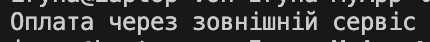

# Adapter
Ідея адаптера: 

дозволяє “підключити” несумісні частини коду.

Як працює код: 

Адаптер дозволяє використовувати сторонній клас, який має інший інтерфейс.
Наш магазин очікує метод Pay(), але зовнішній сервіс має MakeForeignPay().
Адаптер «перекладає» виклики між ними — як перекладач між двома мовами.

Навіщо: 

можна використовувати сторонній код, не переписуючи його.
Цей патерн зручно застосовувати, коли треба підключити сторонній API, не змінюючи основний код.


## Код
```csharp
using System;

// Сторонній клас, який не підходить до нашої системи
class ForeignPaymentSystem
{
    public void MakeForeignPay() => Console.WriteLine("Оплата через зовнішній сервіс");
}

// адаптер
class PaymentAdapter
{
    private ForeignPaymentSystem foreign = new ForeignPaymentSystem();

    public void Pay()
    {
        foreign.MakeForeignPay();
    }
}

class Program
{
    static void Main()
    {
        var adapter = new PaymentAdapter();
        adapter.Pay();
    }
}
```
## Результат

